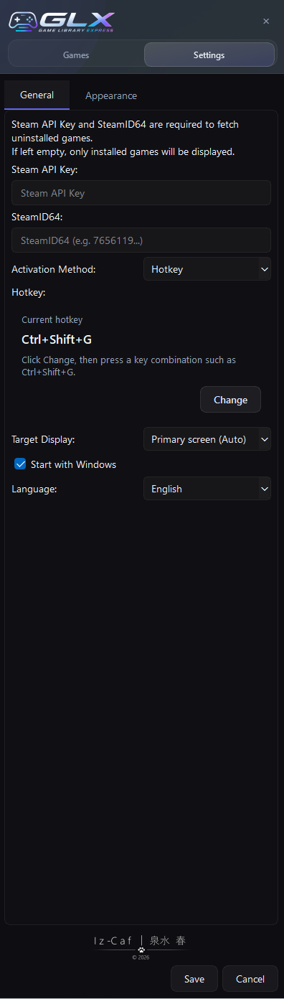
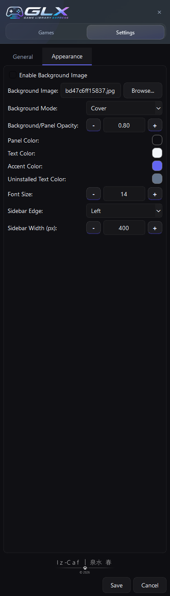

# Game Library Express

A desktop launcher designed to manage large game libraries  
with as little friction and as few actions as possible.

Game Library Express (GLX) is a lightweight, keyboard-driven launcher  
built for Steam-heavy users.

Focused on overlay access, hotkey activation, and fast search,  
GLX aims to reduce the friction between  
“finding a game” and “launching a game.”

---

## Features

- Instant access via hotkeys
- Fast keyboard-driven navigation
- Steam library integration
- Dark glass-style UI
- Custom background image support
- Multi-monitor support
- Lightweight resident desktop launcher
- Installed / uninstalled game status display
- Game title search
- Favorites management

---

## Screenshots

### Desktop View

### Settings Screen

---

## Download

The latest version can be downloaded from Releases.

*Currently Windows only.*

---

## Notes

This application is currently unsigned,  
so Windows Defender may display a warning message.

If that happens, select:

"More info" → "Run anyway"

---

## Development Status

Game Library Express is actively under development.

The project is continuously improving  
with a focus on UI, usability, and performance.

---

## About This Repository

This repository provides:

- README
- Screenshots
- Changelog
- Release builds (.exe)

---

## Author

Created by 泉水春 - Iz-Caf

GitHub Pages:
https://izumi-haru.github.io/
