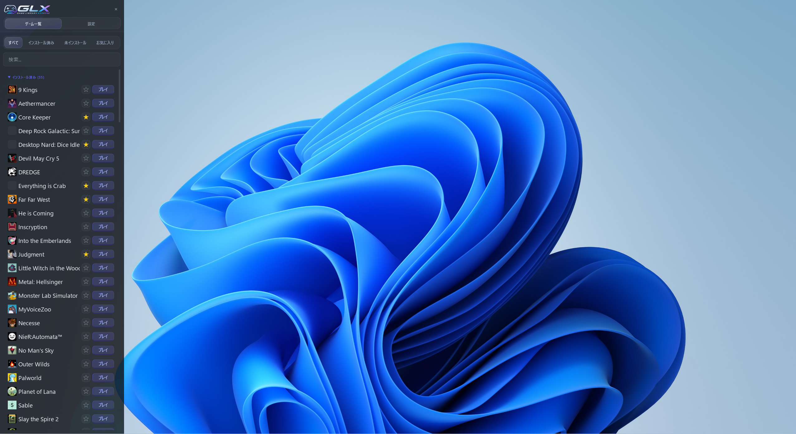
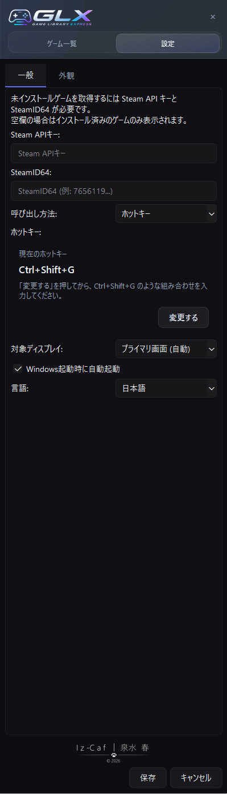
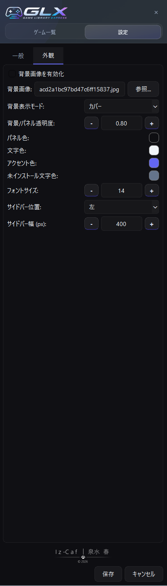

# Game Library Express

大量のゲームライブラリを、  
できるだけ少ない操作で、快適に扱うためのデスクトップランチャーです。

Game Library Express（GLX）は、  
Steamヘビーユーザー向けに設計された  
キーボード主体の軽量ゲームランチャーです。

オーバーレイ表示・ホットキー起動・高速検索を中心に、  
「ゲームを探す」「起動する」までのストレスを減らすことを目的としています。

---

## 特徴

- ホットキーによる瞬時の呼び出し
- キーボード主体の高速操作
- Steamライブラリとの連携
- ダーク＆ガラス調UI
- 背景画像設定
- マルチモニター対応
- 軽量な常駐型デスクトップランチャー
- ゲームのインストール状態表示
- ゲームタイトルの検索
- お気に入り管理

---

## スクリーンショット

### デスクトップ画面

### 設定画面

---

## ダウンロード

最新版は Releases からダウンロードできます。

※ 現在 Windows のみ対応

---

## 注意事項

本アプリは現在コード署名を行っていないため、  
Windows Defender に警告が表示される場合があります。

その場合は「詳細情報」→「実行」を選択してください。

---

## 開発状況

Game Library Express は現在も継続開発中です。

UI・操作性・パフォーマンスを中心に改善を続けています。

---

## このリポジトリについて

このリポジトリでは以下を公開しています。

- README
- スクリーンショット
- 更新履歴
- リリース版（exe）

---

## 作者

Created by 泉水春 - Iz-Caf

GitHub Pages:
https://izumi-haru.github.io/
